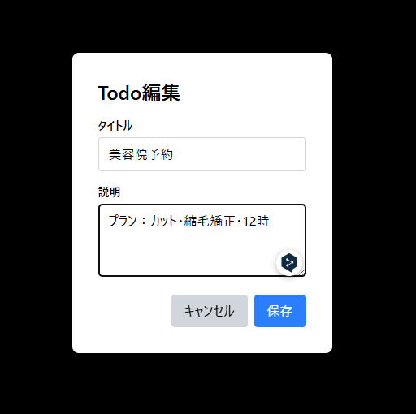
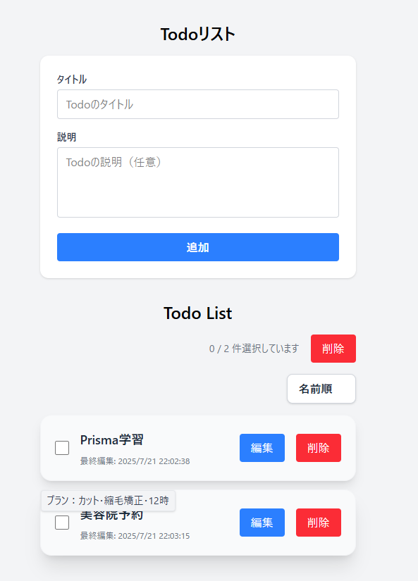

# prisma-todo-app

## 機能紹介(2025.07.21)

<div style="display:flex; column-gap: 8px">
    
    
    
</div>

## セットアップ手順

1. リポジトリをクローン

```bash
git clone <このリポジトリのURL>
cd prisma-todo-app
```

2. 依存パッケージをインストール

```bash
npm ci
```

3. 環境変数ファイルを作成

- `.env` ファイルをプロジェクトルートに作成し、`DATABASE_URL`などを設定してください。

4. データベースのセットアップ

```bash
# マイグレーションを適用
npm run migrate:dev

# Prismaクライアントを再生成
npm run generate

# Prisma Studioでデータベースを確認（オプション）
npm run migrate:studio
```

5. 開発サーバーを起動

```bash
npm run dev
```

## データベース接続情報の確認方法（PostgreSQL例）

以下のコマンドでデータベースをセットアップしてください

```bash
# マイグレーションを適用
npm run migrate:dev

# Prismaクライアントを再生成
npm run generate

# Prisma Studioでデータベースを確認（オプション）
npm run migrate:studio
```
